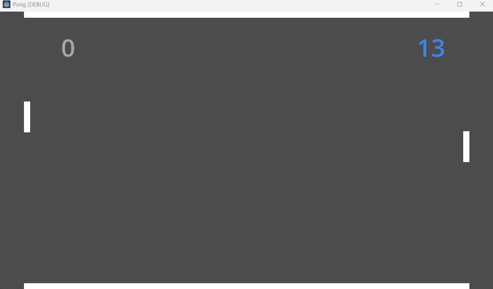

This is an unpolished but otherwise functioning prototype of PONG developed in Godot 4.3 as part of the [20 games challenge](https://20_games_challenge.gitlab.io/).

Requirements
------------

- Godot 4.3

Limitations
---

- Does not use physics
- Bugs are everywhere
- One player only (left) versus a rudimentary AI Player
